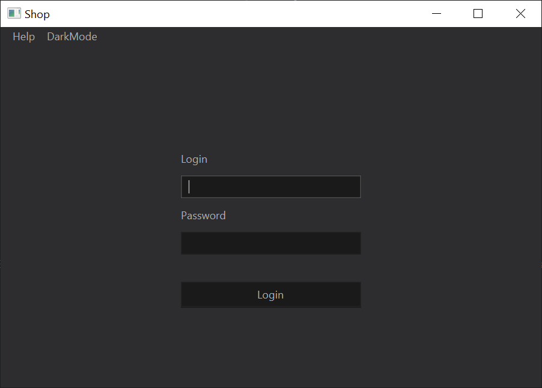
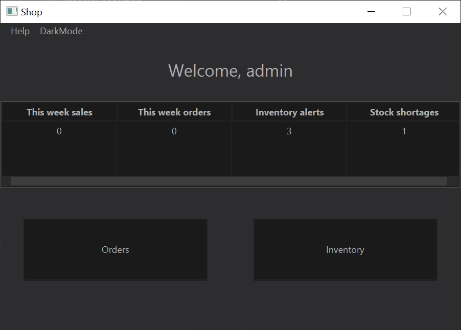
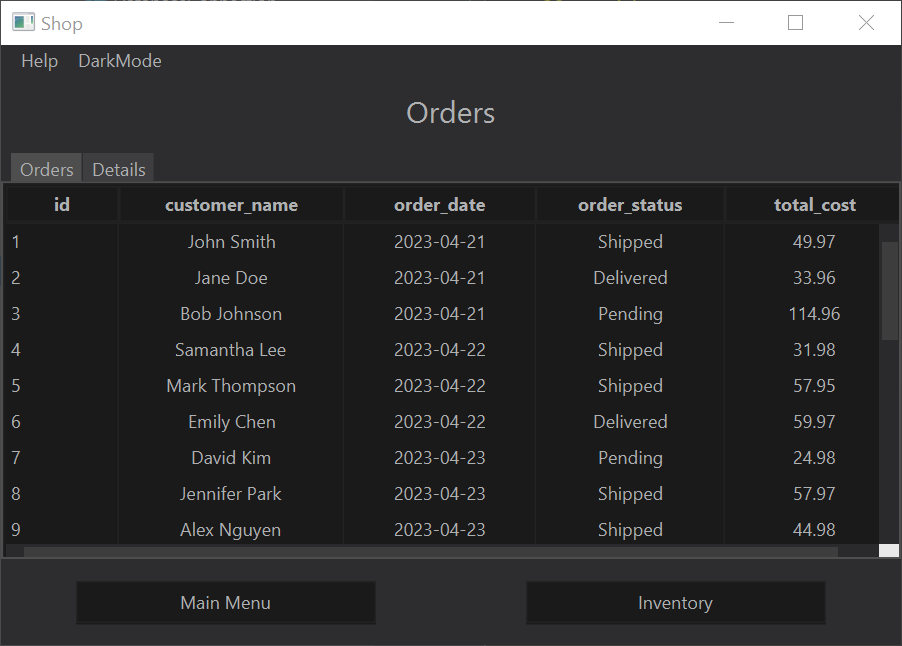
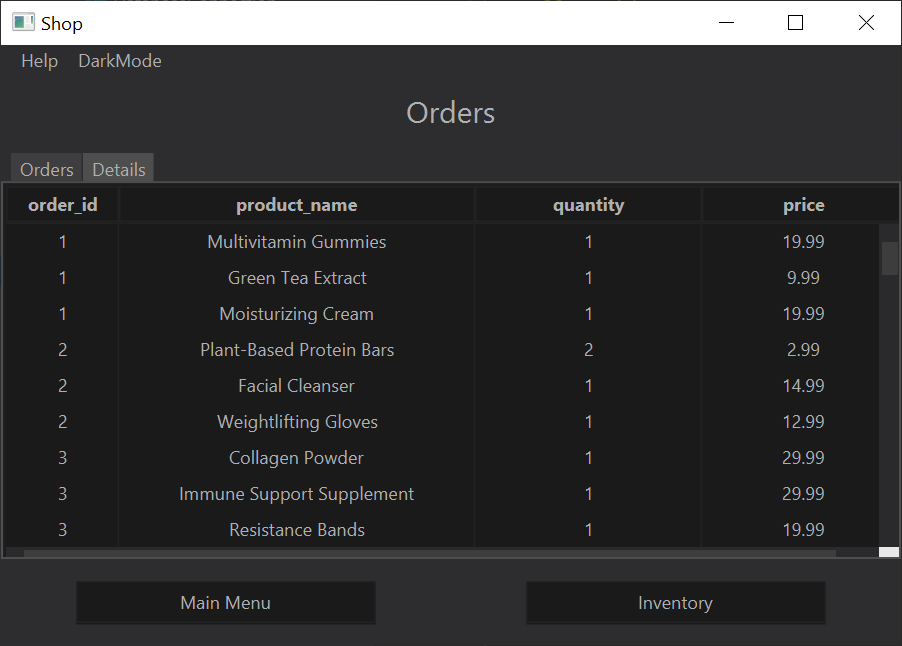
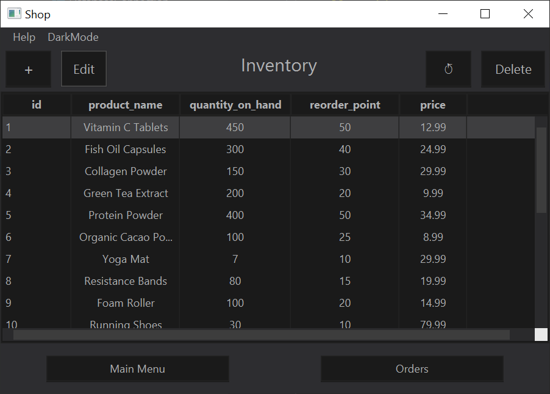
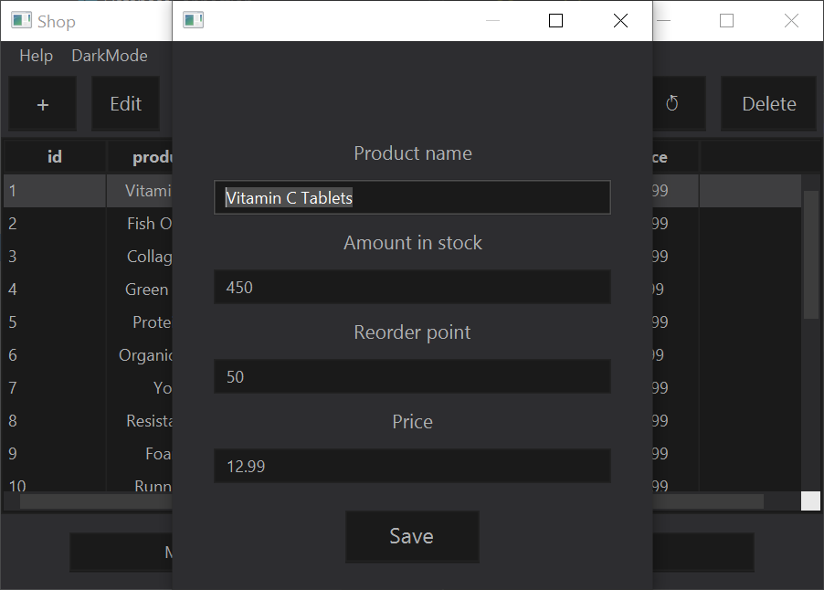

# Simple Store Manager

Simple Store Manager is a Java application designed to streamline the management of a retail store's inventory and sales data. Integrated with MySQL, this application allows users to monitor orders and products available in stock, as well as display sales statistics and inventory shortages. It supports real-time updates to inventory data, allowing users to add, remove, or edit product details or quantities.

## Features

- **Order and Inventory Viewing:** View details of current orders and check stock levels for all products.
- **Sales Statistics:** Access real-time sales data for current week.
- **Inventory Management:** Add, remove, or modify products and their quantities in the stock.
- **Inventory Shortages:** Automatically displays alerts for products that are low in stock.
- **Two Theme Modes:** Choose between a Light and a Dark mode for ease of use during different times of the day or according to user preference.

## Built with

**IDE:** Intellij IDEA Comunity Edition  
**Runtime:** jdk-17.0.1  
**Additional drivers:** mysql-connector-j-8.0.33.jar  
**Libraries:** javafx

## Preview

## License

This project is licensed under the [GPLv3 license](https://www.gnu.org/licenses/gpl-3.0.en.html). By contributing to this repository, you agree to license your contributions under the same license.
